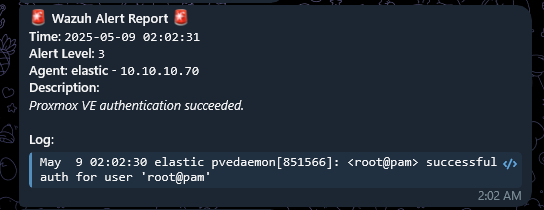
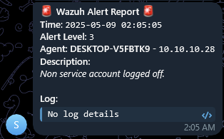

# Wazuh Telegram Alert Using Bash Script Instead of Python
If you are using Wazuh for Security Monitoring, you may heard about Telegram Alert but using Python. But this case I want using bash script, in the case using Docker Container for Wazuh System but without rebuild the image container.

# Screenshot
<center>


**Alert with log**

---

**Alert without**

---

</center>

# Step
This step is using **Docker Single Node**, but for every installation you can read Official Documentation. You can use this alert Telegram for native installation but doing with your own.

1. Follow the [Offial Documentation](https://documentation.wazuh.com/4.11/deployment-options/docker/wazuh-container.html#) only for
    - Clone wazuh docker deployment
    - Change password
    - Generate cert
2. Clone this repo then copy file `custom-telegram` and `jq.sh` to same directory where wazuh single node github directory it was.
3. Change to wazuh single node directory and change file permissions for execute
    ```shell
    chmod 755 custom-telegram jq.sh
    ```
4. Modify volume in `docker-compose.yml` for Wazuh Manager only, example in docker compose file or yaml code below:
    ```yaml
    services:
      wazuh.manager:
        volumes:
          # ... other volume
          - ./custom-telegram:/var/ossec/integrations/custom-telegram
          - ./entrypoint.sh:/etc/cont-init.d/10-jq.sh
    # ........ service and setup
    ```
5. Create Telegram BOT and get Bot Token
6. Add telegram integration to `config/wazuh_cluster/wazuh_manager.conf` and change the `<YOUR_BOT_TOKEN>` with yours, and change level as you need. Example:
    ```xml
    <!-- other configuration -->

    <!-- Begin of Copy -->
    <integration>
      <name>custom-telegram</name>
      <level>11</level>
      <hook_url>https://api.telegram.org/bot<YOUR_BOT_TOKEN>/sendMessage</hook_url>
      <alert_format>json</alert_format>
    </integration>
    <!-- End of Copy -->
    
    <!-- Osquery integration -->
    <wodle name="osquery">
    <!-- other configuration -->
    ```
7. In single node directory you can run the Docker Container
    ```shell
    docker compose up -d
    ```
8. Change level to 0 for testing.

# How it works?
1. `custom-telegram` will called by ossec.conf configuration in integration directory with same name, and send alert using json format to bot.
2. Bot api will proccessing code using `jq` but if `jq` is not installed, parsing will using grep instead. Using grep is not recommended for parsing json but ...
3. Wazuh official container doesn't have `jq` but if you follow this step, you already installing `jq` every start container using s6 service directory. This step written in `jq.sh` and mount to service directory.
4. Now you able sending wazuh alert using bash script instead of python.